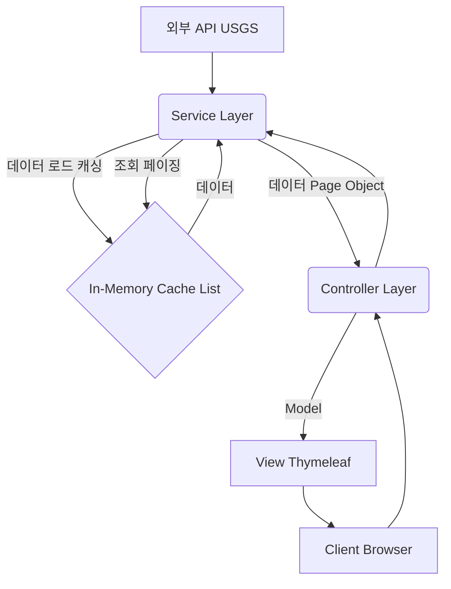
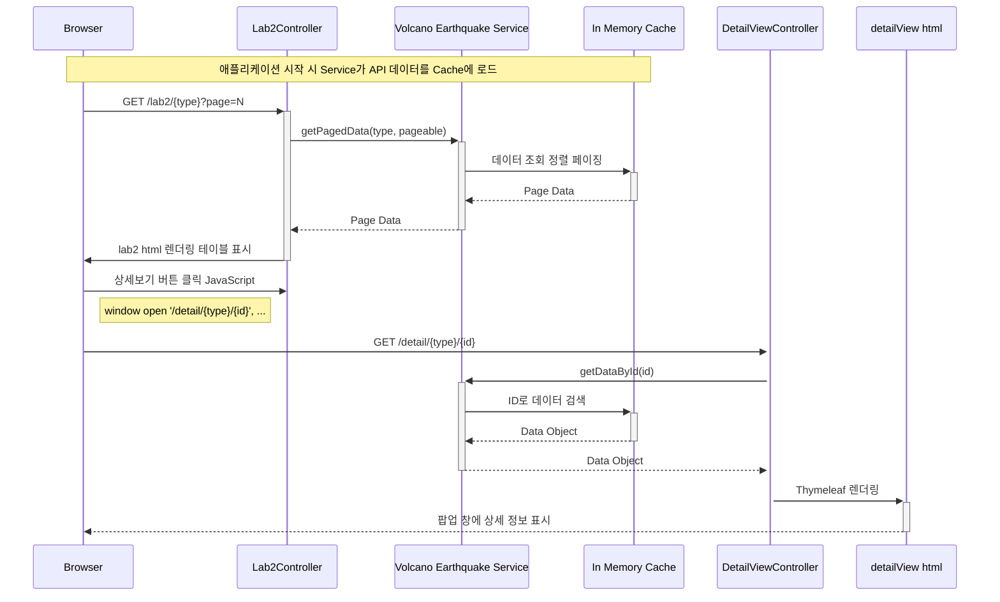

# 실행사진


## 상세 보기


# Nature's Fury Viz - 자연재해 데이터 시각화 프로젝트

전 세계의 화산 및 지진 데이터를 조회하고 상세 정보를 확인할 수 있는 Spring Boot 기반 웹 애플리케이션입니다.

## 주요 기능

*   **데이터 목록 조회:** 화산 또는 지진 데이터를 테이블 형태로 목록 조회 (서버 사이드 페이징 적용).
*   **상세 정보 확인:** 목록의 '상세보기' 버튼 클릭 시, 해당 데이터의 상세 정보가 담긴 팝업 창 표시.
*   **데이터 소스:** USGS (미국 지질조사국)의 실시간 API를 통해 데이터를 가져옵니다.
*   **In-Memory 캐싱:** 애플리케이션 시작 시 API로부터 데이터를 미리 로드하여 메모리에 캐싱하여 빠른 응답 속도를 제공합니다.

## 기술 스택

*   **Backend:** Java, Spring Boot
*   **Frontend:** HTML, CSS, JavaScript, Thymeleaf, Bootstrap
*   **Data Fetching:** Spring `RestTemplate`
*   **Build Tool:** Gradle (또는 Maven)
*   **Logging:** Logback

## 프로젝트 구조

```
src
├── main
│   ├── java
│   │   └── com/springboot/lab02
│   │       ├── Lab02Application.java       # 메인 애플리케이션 클래스
│   │       ├── config
│   │       │   └── AppConfig.java            # 애플리케이션 설정 (RestTemplate 빈)
│   │       ├── controller
│   │       │   ├── Lab2Controller.java       # 메인 목록 페이지 컨트롤러
│   │       │   └── DetailViewController.java # 상세 정보 페이지 컨트롤러
│   │       ├── model
│   │       │   ├── Volcano.java            # 화산 데이터 모델
│   │       │   └── Earthquake.java         # 지진 데이터 모델
│   │       └── service
│   │           ├── DataService.java          # 데이터 서비스 인터페이스
│   │           ├── VolcanoService.java     # 화산 데이터 서비스 구현체
│   │           └── EarthquakeService.java  # 지진 데이터 서비스 구현체
│   └── resources
│       ├── static
│       │   └── css
│       │       ├── lab2.css                # 메인 페이지 스타일
│       │       └── detailView.css        # 상세 정보 페이지 스타일
│       └── templates
│           ├── lab2.html                 # 메인 목록 페이지 템플릿
│           ├── detailView.html         # 상세 정보 페이지 템플릿
│           └── fragments
│               └── common.html           # 공통 UI 프래그먼트
└── test
    └── java
        └── ...                         # 테스트 코드
```

## 아키텍처 개요



1.  **Service Layer (`VolcanoService`, `EarthquakeService`):**
    *   애플리케이션 시작 시 `@PostConstruct`를 통해 외부 API (USGS)에서 데이터를 비동기적으로 가져옵니다.
    *   가져온 데이터를 내부 **In-Memory Cache** ( `CopyOnWriteArrayList`)에 저장합니다.
    *   Controller로부터 요청이 오면 캐시된 데이터를 기반으로 ID 조회 또는 페이징/정렬 처리를 수행하여 `Page` 객체나 단일 데이터 객체(`Volcano`/`Earthquake`)를 반환합니다.
2.  **Controller Layer (`Lab2Controller`, `DetailViewController`):**
    *   Client(브라우저)의 HTTP 요청을 받아 처리합니다.
    *   `/lab2/{type}`: 목록 조회 요청 시 `VolcanoService` 또는 `EarthquakeService`의 페이징 메서드를 호출하여 `Page` 객체를 받습니다. 받은 데이터를 Model에 담아 `lab2.html` 뷰를 렌더링합니다.
    *   `/detail/{type}/{id}`: 상세 정보 페이지 요청 시 해당 서비스의 `getDataById` 메서드를 호출하여 특정 객체를 받고, Model에 담아 `detailView.html` 뷰를 렌더링합니다.
3.  **View Layer (`lab2.html`, `detailView.html`):**
    *   Thymeleaf 템플릿 엔진을 사용하여 Controller로부터 받은 데이터를 동적으로 HTML 페이지에 표시합니다.
    *   Bootstrap을 사용하여 기본적인 UI 스타일링을 적용합니다.
    *   `lab2.html`에서는 JavaScript를 사용하여 '상세보기' 버튼 클릭 시 `window.open()`으로 팝업 창을 띄웁니다.

## 요청 처리 흐름 (목록 조회 및 상세보기 팝업)



## 설정 및 실행

1.  **요구 사항:**
    *   Java Development Kit (JDK) 17 이상 설치
    *   Gradle 또는 Maven 설치
2.  **빌드 및 실행:**
    *   **Gradle:**
        ```bash
        ./gradlew build
        java -jar build/libs/lab02-0.0.1-SNAPSHOT.jar 
        ```
    *   **Maven:**
        ```bash
        ./mvnw package
        java -jar target/lab02-0.0.1-SNAPSHOT.jar
        ```
3.  **접속:** 웹 브라우저에서 `http://localhost:8080/lab2/volcano` 또는 `http://localhost:8080/lab2/earthquake` 로 접속합니다.

## 참고

*   본 프로젝트는 데이터베이스를 사용하지 않고 In-Memory 캐싱 방식으로 데이터를 관리합니다. 따라서 애플리케이션 재시작 시 캐시된 데이터는 초기화되고 다시 API로부터 로드됩니다.
*   외부 API (USGS)의 응답 형식이나 상태에 따라 데이터 로딩이 실패할 수 있습니다.
