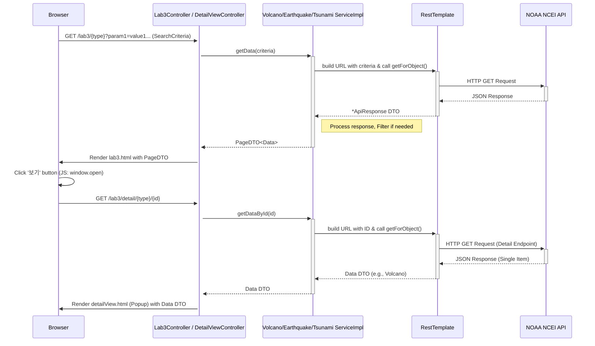

# 실행사진

## 목록 및 검색


## 상세 보기


# Nature's Fury Viz - 자연재해 데이터 시각화 프로젝트 (Lab03)

전 세계의 화산, 지진, 쓰나미 발생 데이터를 조회하고 다양한 조건으로 검색하며, 상세 정보를 확인할 수 있는 Spring Boot 기반 웹 애플리케이션입니다.

## 주요 기능

*   **데이터 목록 조회:** 화산, 지진, 쓰나미 데이터를 유형별 탭으로 구분하여 테이블 형태로 목록 조회 (서버 사이드 페이징 적용).
*   **상세 정보 확인:** 목록의 '보기' 버튼 클릭 시, 해당 데이터의 상세 정보가 담긴 팝업 창 표시.
*   **다양한 검색 조건:**
    *   발생 기간 (시작일, 종료일)
    *   화산: 최소 고도, 최소 VEI (화산폭발지수)
    *   지진: 최소/최대 규모
    *   쓰나미: 최소 최대 수위, 최소 Runups 수
    *   위치: 위도/경도 범위
*   **데이터 소스:** **NOAA (미국 해양대기청) NCEI API**를 통해 데이터를 실시간으로 가져옵니다.
*   **동적 API 호출:** 사용자 요청 시 필요한 데이터를 API로부터 직접 조회하여 응답합니다. (기존 In-Memory 캐싱 방식 제거)

## 기술 스택

*   **Backend:** Java 17, Spring Boot 3.x
*   **Frontend:** HTML, CSS, JavaScript, Thymeleaf, Bootstrap 5
*   **Data Fetching:** Spring `RestTemplate`
*   **Build Tool:** Gradle
*   **Logging:** Logback (via SLF4j)
*   **Dependencies:** Lombok (코드 간결화)

## 프로젝트 구조

```
src
├── main
│   ├── java
│   │   └── com/springboot/lab03            # 기본 패키지
│   │       ├── Lab03Application.java       # 메인 애플리케이션 클래스
│   │       ├── config
│   │       │   └── AppConfig.java            # 애플리케이션 설정 (RestTemplate 빈 등록)
│   │       ├── controller
│   │       │   ├── HomeController.java       # 루트 경로 핸들러 (목록 페이지로 리다이렉트)
│   │       │   ├── Lab3Controller.java       # 데이터 목록 및 검색 결과 페이지 컨트롤러
│   │       │   └── DetailViewController.java # 상세 정보 팝업 페이지 컨트롤러
│   │       ├── dto                         # 데이터 전송 객체 (Data Transfer Objects)
│   │       │   ├── api                     # API 응답 구조 관련 DTO
│   │       │   │   ├── BaseApiResponse.java
│   │       │   │   ├── EarthquakeApiResponse.java
│   │       │   │   ├── TsunamiApiResponse.java
│   │       │   │   └── VolcanoApiResponse.java
│   │       │   ├── Earthquake.java         # 지진 데이터 DTO
│   │       │   ├── PageDTO.java            # 페이징 처리를 위한 DTO
│   │       │   ├── SearchCriteria.java     # 검색 조건을 담는 DTO
│   │       │   ├── Tsunami.java            # 쓰나미 데이터 DTO
│   │       │   └── Volcano.java            # 화산 데이터 DTO
│   │       └── service                     # 비즈니스 로직 및 외부 API 연동 서비스
│   │           ├── DataService.java          # 데이터 서비스 공통 인터페이스 (삭제됨 - 각 서비스 인터페이스로 대체)
│   │           ├── EarthquakeService.java     # 지진 데이터 서비스 인터페이스
│   │           ├── EarthquakeServiceImpl.java # 지진 데이터 서비스 구현체
│   │           ├── TsunamiService.java      # 쓰나미 데이터 서비스 인터페이스
│   │           ├── TsunamiServiceImpl.java  # 쓰나미 데이터 서비스 구현체
│   │           ├── VolcanoService.java      # 화산 데이터 서비스 인터페이스
│   │           └── VolcanoServiceImpl.java  # 화산 데이터 서비스 구현체
│   └── resources
│       ├── application.properties        # 애플리케이션 설정 (NOAA API URL 등)
│       ├── static
│       │   └── css                       # 정적 CSS 파일
│       │       ├── lab3.css
│       │       └── detailView.css
│       └── templates                     # Thymeleaf 템플릿 파일
│           ├── lab3.html                 # 데이터 목록 및 검색 페이지 템플릿
│           ├── detailView.html         # 상세 정보 팝업 페이지 템플릿
│           └── fragments
│               └── common.html           # 공통 UI 프래그먼트 (네비게이션 바, 푸터 등)
└── test
    └── java                            # 테스트 코드 (현재 비어있음)
```

## 아키텍처 개요

```mermaid
graph TD
    subgraph Client Tier
        A[Browser Client]
    end
    subgraph Application Server Tier
        B[Controller Layer (Spring MVC)]
        C[Service Layer (Spring Service)]
        D[RestTemplate (HTTP Client)]
    end
    subgraph External Services
        E[NOAA NCEI API]
    end

    A -- HTTP Request (Search, Detail) --> B;
    B -- Call Service Method (with SearchCriteria/ID) --> C;
    C -- Build API URL & Request --> D;
    D -- HTTP GET --> E;
    E -- API Response (JSON) --> D;
    D -- Return Response DTO --> C;
    C -- Process Data & Return DTO (PageDTO/Data) --> B;
    B -- Add Data to Model --> F[View Layer (Thymeleaf)];
    F -- Render HTML --> A;

    style E fill:#f9f,stroke:#333,stroke-width:2px
```

1.  **Client (Browser):** 사용자는 웹 브라우저를 통해 데이터 목록 조회, 검색 조건 입력, 상세 정보 보기 등을 요청합니다.
2.  **Controller Layer (`HomeController`, `Lab3Controller`, `DetailViewController`):**
    *   사용자의 HTTP 요청(GET)을 받아 해당 요청에 맞는 Service 메소드를 호출합니다.
    *   목록/검색 요청 시 `SearchCriteria` 객체를 파라미터로 받습니다.
    *   상세 정보 요청 시 URL 경로에서 데이터 ID를 추출합니다.
    *   Service로부터 받은 데이터(DTO)를 Model 객체에 담아 View(Thymeleaf)에 전달합니다.
3.  **Service Layer (`*ServiceImpl`):**
    *   Controller로부터 전달받은 `SearchCriteria` 또는 ID를 기반으로 NOAA API에 요청할 URL을 동적으로 구성합니다. (`UriComponentsBuilder` 사용)
    *   `RestTemplate`을 이용하여 NOAA API를 호출하고, 응답(JSON)을 해당 `*ApiResponse` DTO 객체로 변환합니다.
    *   API 응답 데이터를 필요한 형태(`PageDTO` 또는 개별 데이터 DTO)로 가공합니다.
    *   (참고: API가 지원하지 않는 상세 조건 필터링은 Service 단에서 추가로 수행될 수 있습니다.)
    *   처리된 데이터를 Controller에 반환합니다.
4.  **View Layer (`lab3.html`, `detailView.html`):**
    *   Thymeleaf 템플릿 엔진을 사용하여 Controller로부터 받은 데이터를 HTML 페이지에 동적으로 렌더링합니다.
    *   Bootstrap 및 커스텀 CSS를 사용하여 UI를 구성합니다.
    *   `lab3.html`에서는 JavaScript를 사용하여 '보기' 버튼 클릭 시 `window.open()`으로 상세 정보 팝업 창을 띄웁니다.

## 요청 처리 흐름 (목록 검색 및 상세보기 팝업)



## 설정 및 실행

1.  **요구 사항:**
    *   Java Development Kit (JDK) 17 이상 설치
    *   Gradle 설치 (또는 IDE 내장 Gradle 사용)
2.  **API Base URL 설정:**
    *   `src/main/resources/application.properties` 파일에 NOAA API의 기본 URL을 설정해야 합니다.
        ```properties
        noaa.api.base-url=https://www.ngdc.noaa.gov
        ```
3.  **빌드 및 실행:**
    *   프로젝트 루트 디렉토리에서 다음 명령어를 실행합니다.
    *   **Gradle:**
        ```bash
        ./gradlew build
        java -jar build/libs/lab03-0.0.1-SNAPSHOT.jar 
        ```
    *   (참고: 빌드 결과물 이름 `lab03-0.0.1-SNAPSHOT.jar`는 `build.gradle` 설정에 따라 다를 수 있습니다.)
4.  **접속:** 웹 브라우저에서 다음 URL 중 하나로 접속합니다.
    *   `http://localhost:8080/` (기본값: 화산 목록으로 리다이렉트)
    *   `http://localhost:8080/lab3/volcano`
    *   `http://localhost:8080/lab3/earthquake`
    *   `http://localhost:8080/lab3/tsunami`

## 참고

*   본 프로젝트는 **데이터베이스를 사용하지 않고**, 사용자 요청 시마다 **NOAA API를 직접 호출**하여 데이터를 가져옵니다. 따라서 네트워크 상태 및 NOAA API 서버 상태에 응답 속도 및 가용성이 영향을 받을 수 있습니다.
*   NOAA API의 제약 조건(예: 특정 필터 미지원)으로 인해 일부 검색 조건(날짜 범위, 위/경도 등)은 API에서 1차 필터링 후, 애플리케이션(Service Layer)에서 2차 필터링을 수행할 수 있습니다.
*   오류 처리: 기본적인 예외 처리(API 호출 오류, 잘못된 ID 형식 등)는 구현되어 있으나, 실제 운영 환경에서는 더 견고한 오류 처리 전략이 필요할 수 있습니다.
