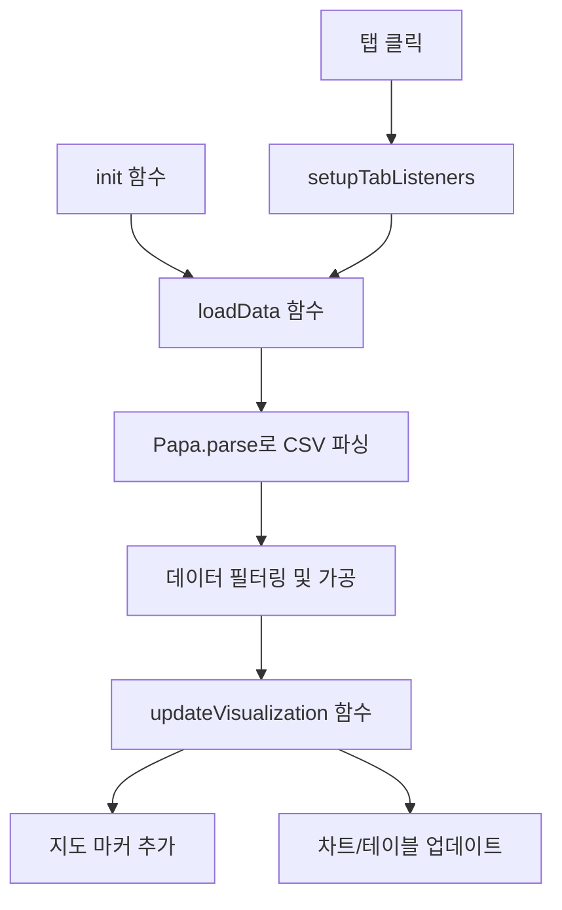

# 결과물

## 데이터 흐름도

## 실행 화면

## 주요 기능

1. **데이터 로드 (loadData)**
   - CSV 파일을 fetch로 가져옴
   - Papa.parse로 CSV 데이터 파싱
   - 데이터 타입별로 다른 필터링 적용:
     - 지진: 1995-2023년 데이터
     - 화산/쓰나미: 1950-2023년 데이터

2. **시각화 업데이트 (updateVisualization)**
   - 지도 마커:
     - 지진: 초록색
     - 화산: 빨간색
     - 쓰나미: 파란색
   - 테이블 표시:
     - 연도별 색상 구분
     - 강도별 색상 구분 (VEI/규모/원인)

3. **사용자 인터랙션**
   - 탭 클릭 시 해당 데이터 로드
   - 마커 클릭 시 상세 정보 팝업
   - 범례로 데이터 구분 확인 